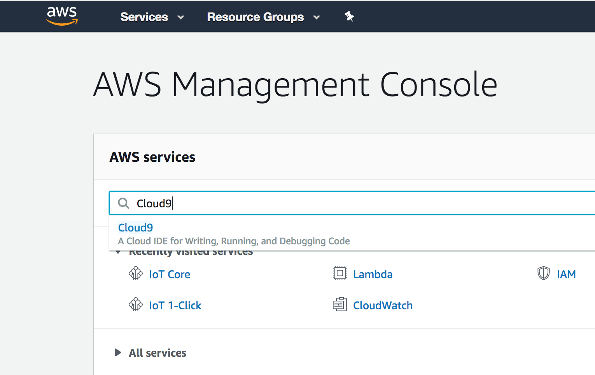
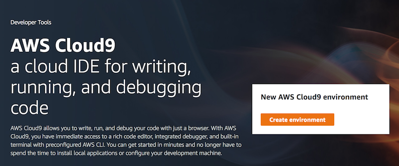
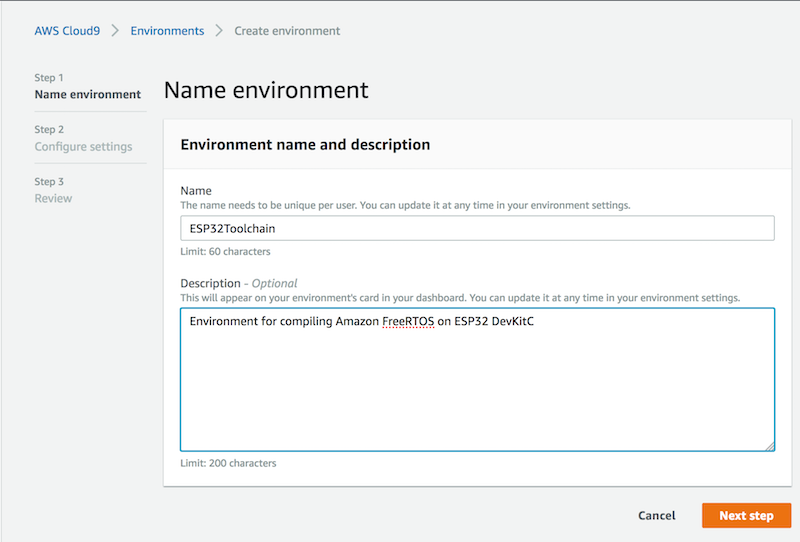
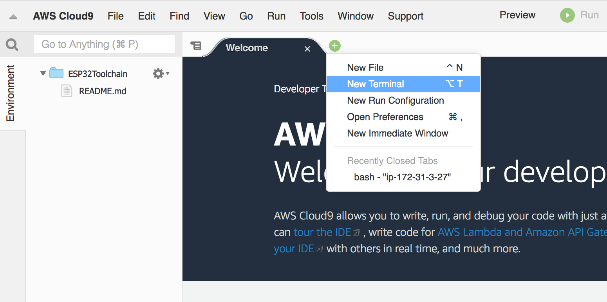

## Create Cloud9 Environment

1. Log in to your AWS Account Console and search for Cloud9

2. Create New Environment

- name your environment and provide a description, then press *Next step*

- use t2.micro instance
- set up auto-hibernate option
- press *Next step*

- review and press *Create environment*

3. Open new Terminal window

