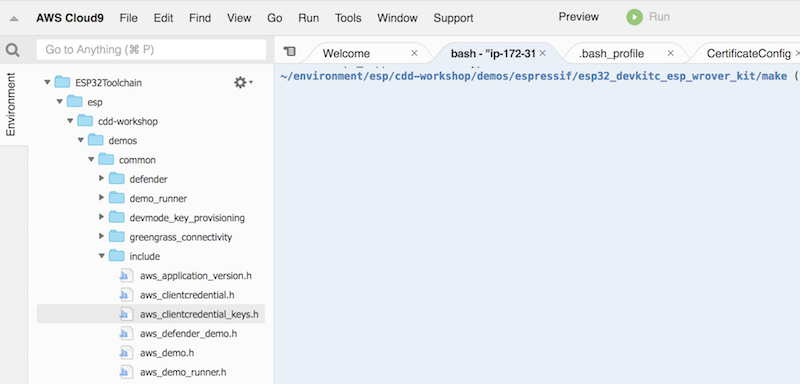
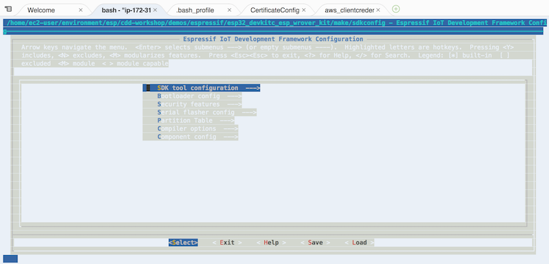
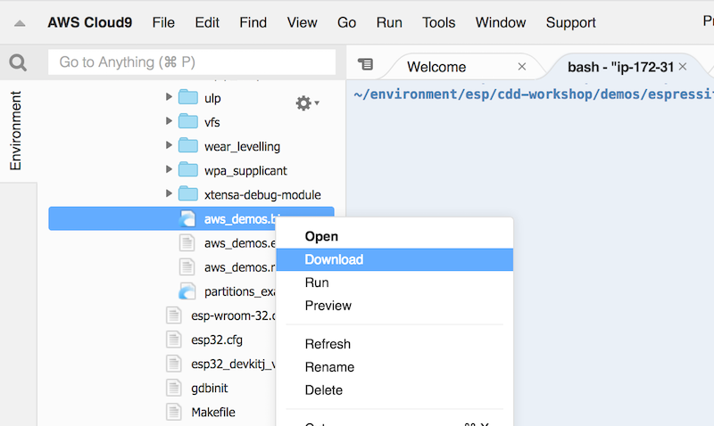

## Steps to compile Connected Drink Dispenser Workshop firmware for ESP32

1. Clone the repo:

```bash
git clone https://github.com/yona75/cdd-workshop
```

2. Navigate to https://yona75.github.io/credformatter/, upload Certificate and Private key provided to you and generate aws_clientcredential_keys.h file

3. Copy the file to ~/cdd-workshop/demos/common/include directory by dragging it there



4. Copy aws_clientcredential.h template and rename it

```bash
cp ~/environment/esp/cdd-workshop/tools/aws_config_quick_start/aws_clientcredential.templ \
  ~/environment/esp/cdd-workshop/demos/common/include/aws_clientcredential.h
```
5. Edit the aws_clientcredential.h file to change following values 
(Please note that clientcredentialWIFI_SECURITY defined without double quotes)
Also, the thing name is the number associated with your drink dispenser (e.g. #define clientcredentialIOT_THING_NAME "203">

```bash
static const char clientcredentialMQTT_BROKER_ENDPOINT[] = <"Will be provided">;
#define clientcredentialIOT_THING_NAME <"thing name provided to you individually">
#define clientcredentialWIFI_SSID       "Condensate"
#define clientcredentialWIFI_PASSWORD   <"WillBeProvided">
#define clientcredentialWIFI_SECURITY   eWiFiSecurityWPA2
```

6. Save the file

7. In the Terminal window navigate to *~/environment/esp/cdd-workshop/demos/espressif/esp32_devkitc_esp_wrover_kit/make* and execute *make menuconfig* command:

```bash
cd ~/environment/esp/cdd-workshop/demos/espressif/esp32_devkitc_esp_wrover_kit/make 
make menuconfig
```

8. Click *Save* and then *Exit*



9. Execute *make* command

```bash
make
```

10. Once compilation is done, download these 3 files to your local computer:
- *build/aws_demos.bin*
- *build/partitions_example.bin*
- *build/bootloader/bootloader.bin*


